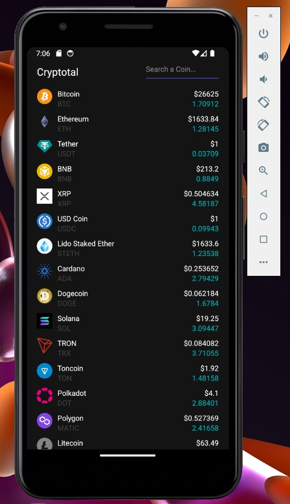
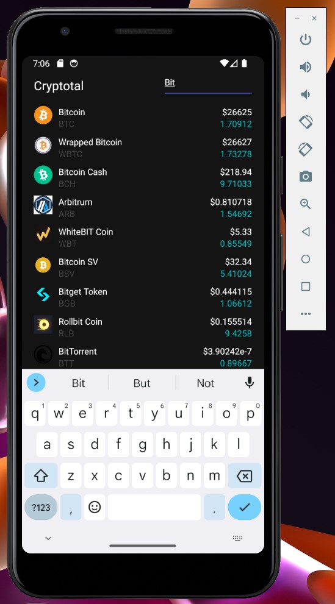

#  Ecommerce de ropa creado con ReactJS y API de Paypal v1.1.1
## Descripción del proyecto

Aplicación de visualización de mercado y estado de las Cryptomonedas, esta
esta creada con React Native y con la API de CoinGecko. Esta app,
tiene soporte para dispositivos Android e iOS.

## Imagenes

Vista general del mercado de las cryptomonedas

Uso de buscador para buscar cryptomoneda en especifico

## Información

Documentación API CoinGecko: https://www.coingecko.com/en/api/documentation

